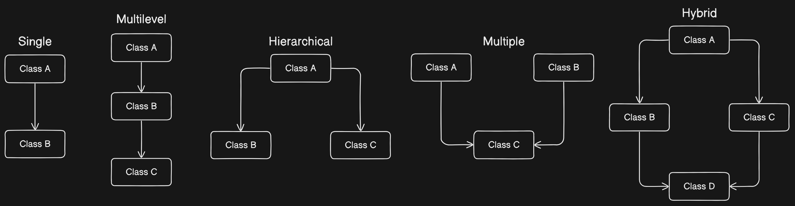
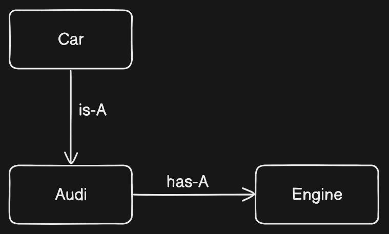

# Object-Oriented Programming (OOP) Concepts

## Table of Contents
- [A. What are the concepts of OOP](#a-what-are-the-concepts-of-oop)
- [B. Is Java 100% Object-oriented](#b-is-java-100-object-oriented)
- [C. Classes and Objects](#c-classes-and-objects)
    - [1. Instance variable](#1-instance-variable)
    - [2. Local variable](#2-local-variable)
    - [3. Volatile variable](#3-volatile-variable)
    - [4. Transient variable](#4-transient-variable)
    - [5. How to access instance variable](#5-how-to-access-instance-variable)
    - [6. How to create an Object](#6-how-to-create-an-object)
- [D. Constructors and Keywords](#d-constructors-and-keywords)
    - [1. this](#1-this)
    - [2. final](#2-final)
    - [3. Constructor](#3-constructor)
    - [4. Constructor Overloading](#4-constructor-overloading)
    - [5. Copy-Constructor](#5-copy-constructor)
    - [6. pass by reference and pass by value](#6-pass-by-reference-and-pass-by-value)
- [E. AutoBoxing and UnBoxing](#e-autoboxing-and-unboxing)
    - [1. Wrapper classes](#1-wrapper-classes)
- [F. Packages](#f-packages)
- [G. Static](#g-static)
- [H. Singleton Class](#h-singleton-class)
- [I. Inheritance](#i-inheritance)
    - [1. super](#1-super)
    - [2. Types of Inheritance](#2-types-of-inheritance)
    - [3. is-A, has-A](#3-is-a-has-a)
    - [4. association, aggregation, composition](#4-association-aggregation-composition)
- [J. Polymorphism](#j-polymorphism)
    - [1. Dynamic Method Dispatch](#1-dynamic-method-dispatch)
- [K. Interfaces](#k-interfaces)
- [L. Abstraction](#l-abstraction)
    - [1. Abstract Classes](#1-abstract-classes)
    - [2. Abstract Class vs Interface](#2-abstract-class-vs-interface)
- [M. Encapsulation](#m-encapsulation)
    - [1. Access Modifiers](#1-access-modifiers)
    - [2. Abstraction vs Encapsulation](#2-abstraction-vs-encapsulation)

## <a name="a-what-are-the-concepts-of-oop">What are the concepts of OOP?</a>
Object-Oriented Programming (OOP) includes:
- Abstraction
- Encapsulation
- Polymorphism
- Inheritance
- Predefined types must be objects
- User-defined types must be objects
- Operations must be performed by sending messages to objects

## <a name="b-is-java-100-object-oriented">Is Java 100% Object-oriented?</a>
Not 100%. Java does not satisfy all the OOP conditions because it uses eight primitive data types (Boolean, byte, char, int, float, double, long, short) which are not objects.

## <a name="c-classes-and-objects">Classes And Objects</a>

A class is a `template` for an object, and an object is an `instance` of a class. 

A class creates a new data type that can be used to create objects. \
When you declare an object of a class, you are creating an instance of that class.

- a class is a **logical construct**
- An object has **physical reality** ( That is, an object occupies space in memory )

Objects are characterized by three essential properties: state, identity, and behavior.
- The `state` of an object is a `value` from its data type. 
- The `identity` of an object `distinguishes` one object from another. 
- The `behavior` of an object is the `effect` of data-type operations.

<a name="1-instance-variable"></a>
<a name="2-local-variable"></a>
<a name="3-volatile-variable"></a>
<a name="4-transient-variable"></a>
**`Instance variable`** are variables inside an Object `(s1.roll)`


**`Local variable`** -  is declared inside a method or constructor. It can be declared within a block.

**`Volatile variable`** - values can be modified by different threads. They will never have the chance to block and hold a lock.
```java
public volatile int count = 0;
```

**`Transient variable`** - would not be serialized even if the class to which it belongs is serialized.
```java
private transient int version = 1;
```

### <a name="5-how-to-access-instance-variable">How to access instance variable?</a>
Using dot `.` operator named as `separator` - which `links` the name of the object with the name of an instance variable.

### <a name="6-how-to-create-an-object">How to create an Object</a>
Using `new` keyword - it dynamically allocates ( that is, allocates at run time ) memory for an object & returns a reference to it.
```java
Student s1; // declaration
s1 = new Student(); // Allocation
s1.roll;
```

**Note:**
>Student student = new Student(); \
>`lhs` [ reference i.e. student ] is looked by `compiler` & `rhs` [ object i.e. new Student( ) ] is looked by `jvm`

## <a name="d-constructors-and-keywords">Constructors and keywords</a>

<a name="1-this"></a>

**`this`** - is always a `reference` to the object on which the method was `invoked`. 

<a name="2-final"></a>

**`final`** - A field can be declared as final. Doing so `prevents` its contents from being `modified`, making it, essentially, a `constant`.

```java
final int FILE_OPEN = 2;
```

<a name="3-constructor"></a>

### Constructor
Is a `special function` that runs when we create an object and allocate some variables.

**`Default` Constructor**
```java
Student s1 = new Student(); 
// new Student( ) is calling the Student( ) constructor.

Student( ) {
    this.rno = 1;
    this.name = "Aditya";
    this.marks = 85;
}
```
**`Parameterised` Constructor**
```java
Student s1 = new Student(1, "Aditya", 85); 
// new Student(1, "Aditya", 85) is calling the Student( int rno, String name, float marks ) constructor.

Student( int rno, String name, float marks ) {
    this.rno = rno;
    this.name = name;
    this.marks = mark;
}
```

To call constructor from another constructor
```java
Student( ) {
    this(1, "Aditya", 85);
}
```

>Any class will have a `default` constructor, does not matter if we declare it in the class or not. *If we inherit a class, then the derived class must call its super class constructor*. It is done by `default` in derived class.


### <a name="4-constructor-overloading">Constructor Overloading</a>
Different constructors can be created for a single class. Each constructor must have its own unique parameter list. 
- `Student ( )` -> defines what happens when object is created. Default data will come.
- `Student ( args )` -> here the data sent will come.

### <a name="5-copy-constructor">Copy-Constructor</a>
Java does support copy constructors like C++, but the difference lies in the fact that Java does not create a default copy constructor if you do not write your own.

### <a name="6-pass-by-reference-and-pass-by-value">Pass by `Reference` and pass by `Value`</a>
When an object is `passed by value`, this means that a copy of the object is passed. Thus, even if changes are made to that object, it does not affect the original value. 

When an object is `passed by reference`, this means that the actual object is not passed, rather a reference of the object is passed. Thus, any changes made by the external method, are also reflected in all places


## <a name="e-autoboxing-and-unboxing">Autoboxing and Unboxing</a> 

`Autoboxing` is the automatic conversion made by the Java compiler between the primitive types and their corresponding object wrapper classes. For example, the compiler converts an int to an Integer, a double to a Double, and so on. If the conversion goes the other way, this operation is called `unboxing`.

### <a name="1-wrapper-classes">Wrapper classes</a> 
Wrapper classes in Java are used to convert primitive data types into objects. Java provides wrapper classes for each of the primitive data types. For example, int has the corresponding wrapper class `Integer`, char has `Character`, and so on.

```java
Integer a = 10;
Integer b = 20;
swap(a, b);
System.out.println(a + " " + b); // 10 20
// will not swap as Integers are final
```

## <a name="f-packages">Packages</a>
Packages are containers for classes. They are used to keep the class name space compartmentalized.

*The package is both a `naming` and a `visibility control mechanism`*

> The following statement creates a package called MyPackage: package MyPackage;

When a package is imported, only those items within the package declared as `public` will be available to `non-subclasses`
in the importing code.

## <a name="g-static">Static</a>
When a member is declared `static`, it can be accessed before any objects of its class are created, and without reference to any object. 

Static method in Java is a method which `belongs to` the `class` and `not` to the `object`.

`main( )` is declared as static because it must be called before any objects exist.


```java
public class Human {
    String message = "Hello World";

    public static void display(Human human){
        System.out.println(human.message);
    }

    public static void main(String[] args) {
        Human a = new Human();
        a.message = "Aditya's message";
        Human.display(a);
    }
}
```

**Static Method**
  - Can only access static data.
  - Cannot access non-static data ( instance variables ).
  - Can call only other static methods.
  - Cannot refer to `this` or `super` keywords.
  - Can be accessed directly by the class name without any object.

**Non-Static Member**
  - Belongs to an instance of the class.
  - Cannot be accessed in a static context without an explicit object reference.

`static block` that gets executed exactly once, when the class is first loaded.

```java
// Demonstrate static variables, methods, and blocks.
class UseStatic {
    static int a = 3;
    static int b;
    static void math(int x) {
        System.out.println("x = " + x);
        System.out.println("a = " + a);
        System.out.println("b = " + b);
    }
    static {
        System.out.println("Static block initialized.");
        b = a * 4;
    }
    public static void main(String args[]) {
        math(42);
    }
}
```
Output
```terminal
Static block initialized
x = 42 
a = 3 
b = 12 
```

- **Only nested classes can be static.**
- **Static inner classes can have static variables.**
- **You cannot override inherited static methods.**
  - Overriding in Java is resolved at run-time.
  - Static methods are resolved at compile time.
- **Static interface methods are not inherited** by implementing classes or sub-interfaces.


```java
public class Static {

    // class Test  // ERROR
    static class Test {
        String name;

        public Test(String name) {
            this.name = name;
        }
    }
    public static void main(String[] args) {
        Test a = new Test("Ram");
        Test b = new Test("Krishna");

        System.out.println(a.name); // Ram
        System.out.println(b.name); // Krishna
    }
}
```

**`Static Nested Classes`**- Declaring a member type `C` as static within a `non-inner` class `T` means `C` is not an `inner class` and has no instance of `T`.

**`Instance Independence`**- `Test` does not have an instance of `Static`, and vice versa. Both can have instances of each other.

## <a name="h-singleton-class">Singleton Class</a>
**Singleton Pattern** ensures a class has only one instance and provides a global point of access to it. 
- Useful for scenarios where a single instance is sufficient to coordinate actions across the system.


```java
public class DoubleCheckedSingleton {
    private static volatile DoubleCheckedSingleton instance;
    public static DoubleCheckedSingleton getInstance() {
        if (instance == null) {
            synchronized (DoubleCheckedSingleton .class) {
                if (instance == null) {
                    instance = new DoubleCheckedSingleton();
                }
            }
        }
        return instance;
    }
  
}
```
**Private Constructor**: Prevents the instantiation of the class from other classes. \
**Static Method** (getInstance): Returns the single instance, creating it if necessary. \
**Global Access**: Ensures only one instance of the class exists, providing a single point of access.

## <a name="i-inheritance">Inheritance</a>
Inheritance provides an object with the ability to access the fields and methods of another class.The one whose properties are inherited is called the `Super class` and who is inheriting the property is called the `Sub class`. \
Inheritance provides reusability of code and can be used to add additional features to an existing class, without modifying it.

To inherit a class, you simply incorporate the definition of one class into another by using the `extends` keyword.

```java
class subclass-name extends superclass-name { 
	// body of class
}
```

```java
SUPERCLASS ref = new SUBCLASS();    
// HERE ref can only access methods which are available in SUPERCLASS
```

*It is important to understand that it is the type of the `reference variable` and `not` the type of the `object` that it refers to that determines what members can be accessed*

### <a name="1-super">super</a>
Whenever a `subclass` needs to refer to its `immediate superclass`, it can do so by use of the keyword `super.`

**Two General Forms**:
  1. Calling the superclass' constructor.
  2. Accessing a member of the superclass hidden by a subclass member.

>*It cannot access those members of the superclass
that have been declared as private* \
>*Every object has their super i.e the `Object Class`*

```java
class Box {
     private double width;
     private double height;
     private double depth;

     // construct clone of an object

     Box(Box ob) { // pass object to constructor
       width = ob.width;
       height = ob.height;
       depth = ob.depth;
     }
}

class BoxWeight extends Box {
     double weight; // weight of box

     // construct clone of an object

     BoxWeight(BoxWeight ob) { // pass object to constructor
        super(ob);
        weight = ob.weight;
     }
}
```

>`super()` always refers to the constructor in the closest superclass.

### <a name="2-types-of-inheritance">Types of Inheritace</a>

1. **Single Inheritance** - A class inherits from one superclass.
2. **Multilevel Inheritance** - A class inherits from another class, which in turn inherits from another class.
3. **Hierarchical Inheritance** - Multiple classes inherit from a single superclass.
4. **Multiple Inheritance** - A class inherits from more than one class. Java does not support this directly due to the "diamond problem". ( Can be achieved using interfaces )
5. **Hybrid Inheritance** - Combination of two or more types of inheritance. Java does not support this directly. ( Can be achieved using interfaces ) \



<a name="3-is-a-has-a"></a>

### `is-A` Relationship
- Represents `inheritance` or `implementation`.
- defines a `hierarchical connection` between a parent class `(superclass)` and a child class `(subclass)`
- Indicates that one class is a subtype of another class or interface.
- **Example**: A `Dog` is a `Animal`.

```java
class Animal {
    void eat() {
        System.out.println("This animal eats food.");
    }
}

class Dog extends Animal {
    void bark() {
        System.out.println("The dog barks.");
    }
}

public class TestInheritance {
    public static void main(String[] args) {
        Dog dog = new Dog();
        dog.eat();  // Inherited from Animal
        dog.bark(); // Defined in Dog
    }
}
```
> Demonstrates `subclassing` and method `inheritance`



### `has-A` Relationship
- Represents `composition` or `aggregation`.
- Indicates that one class `contains a reference` to another class.
- It represents a `whole/part` relationship where the containing class is made up of one or more instances of the referenced class.
- **Example**: A `Car` has an `Engine`.

```java
class Engine {
    void start() {
        System.out.println("Engine starts.");
    }
}

class Car {
    private Engine engine;

    Car() {
        engine = new Engine();
    }

    void startCar() {
        engine.start();
        System.out.println("Car starts.");
    }
}

public class TestComposition {
    public static void main(String[] args) {
        Car car = new Car();
        car.startCar();
    }
}
```
> Demonstrates `object references` and `whole/part` relationships.

<a name="4-association-aggregation-composition"></a>


### What is an `association`?
Association represents the ability of one instance to send a message to another instance. This is typically implemented using a pointer or reference instance variable, a method argument, or a local variable.

```java
public class Driver {
    private Car car;  // Driver has a Car (association)
}
 
public class Car {
    private String model;
    private String make;
}
```

### What is `aggregation`?
Aggregation is a special form of `association` that represents a `whole/part` relationship. In aggregation, parts can exist independently of the whole.

```java
public class Person {
    private Address address;  // Person has an Address (aggregation)
}
 
public class Address {
    private String city;
    private String state;
    private String country;
    private String line1;
    private String line2;
}
```

### What is `composition`?
Composition is a `stronger form` of `aggregation` where the `lifetime` of the **parts** is `controlled` by the **whole**. The parts cannot exist independently of the whole. This control may be direct or transitive. That is, the ‘whole’ may take direct responsibility for creating or destroying the ‘part’, or it may accept an already created part, and later pass it on to some other whole that assumes responsibility for it.

```java
public class Car {
    private Tire[] tires;      // Car has Tires (composition)
    private Door[] doors;      // Car has Doors (composition)
    private Steering steering; // Car has Steering (composition)
    private Window[] windows;  // Car has Windows (composition)
}
 
public class Tire {
    // Tire details
}
   
public class Door {
    // Door details
}
 
public class Steering {
    // Steering details
}
 
public class Window {
    // Window details
}
```

## <a name="j-polymorphism">Polmorphism</a>
Polymorphism is the ability of programming languages to present the same interface for different underlying data types. A polymorphic type is a type whose operations can also be applied to values of some other type. 

`poly` - many & `morphism` - ways to represent


There are two types of Polymorphism in Java: 

**`Compile-time polymorphism`** ( Static binding ) – `Method Overloading`  \
Methods of a class have the same name but differ in the number, type, or order of parameters or return type of method. Java determines which method will be called at `Compile time`.

```java
// Calculator Class
public class Calculator {
 
public int subtract(int a, int b)
{
   return a-b;
}
public double subtract( double a, double b)
{
 return a-b;
}
 
public static void main(String args[])
{
  Calculator calculator = new Calculator();
  System.out.println("Difference of 150 and 12 is " +calculator.subtract(150,12));
  System.out.println("Difference of 15.5 and 15.4 is " +calculator.subtract(15.50,15.40));
}}
```

**`Runtime polymorphism`** ( Dynamic binding ) – `Method Overriding` \
In a class hierarchy, when a method in a `subclass redefines` the `method body` of its's `superclass` with the same name, return type & list of arguments this situation is called method overriding.

```java
// Shape Class
public class Shape {
    public void getArea() {
        System.out.println("Shape Area");
    }  
}
```

Rectangle class overrides getArea \
**`Override annotation`** is used to indicate to the compiler that the method is overridden. Readability of the code is improved using the annotation.

```java
// Rectangle class
public class Rectangle extends Shape{
    @Override
    public void getArea() {
        System.out.println("Rectangle Area");
    } 
    
    public static void main(String args[]) {  
        Shape shape = new Shape();
        
        shape.getArea();
        
        Rectangle rectangle = new Rectangle();  
        
        rectangle.getArea();  
    }  
}
```

### `Dynamic Method Dispatch`
Dynamic method dispatch is the mechanism by which a call to an `overridden method is resolved at runtime, rather than compile time. This is how Java implements runtime polymorphism. Java determines which version of that method to execute based on the type of the object.


## <a name="k-interfaces">Interfaces</a>
Interfaces are defined using the `interface` keyword.
- **Abstract Methods:** By default, methods in an interface are public and abstract.
- **Constants:** Variables in an interface are final and static by default.
- **Specification:** Interfaces specify what a class must do, not how it does it.
- **Multiple Implementation:** A class can implement multiple interfaces.
- **Dynamic Method Resolution:** Interfaces support dynamic method resolution at runtime.

A class implements an interface using the `implements` keyword and must provide concrete implementations for all the abstract methods defined in the interface.

```java
public interface Animal {
    void eat();
    void sleep();
}

public class Dog implements Animal {
    @Override
    public void eat() {
        System.out.println("Dog eats");
    }

    @Override
    public void sleep() {
        System.out.println("Dog sleeps");
    }
}
```

**Default Methods**
Starting with JDK 8, interfaces can include default methods 
```java
public interface Animal {
    void eat();
    void sleep();

    default void makeSound() {
        System.out.println("Animal makes sound");
    }
}
```

**Static Methods**
Interfaces can also have static methods
```java
public interface Animal {
    void eat();
    void sleep();

    static void description() {
        System.out.println("Animals have various behaviors.");
    }
}
```

**Nested Interfaces**
An interface can be declared inside a class or another interface
```java
public class OuterClass {
    public interface NestedInterface {
        void nestedMethod();
    }
}
```

**Extending  Interfaces**
An interface can extend another interface using the extends keyword. Class implementing such an interface must provide implementations for all methods.
```java
public interface Mammal extends Animal {
    void walk();
}

public class Cat implements Mammal {
    @Override
    public void eat() {
        System.out.println("Cat eats");
    }

    @Override
    public void sleep() {
        System.out.println("Cat sleeps");
    }

    @Override
    public void walk() {
        System.out.println("Cat walks");
    }
}
```

## <a name="l-abstraction">Abstraction</a>
Abstraction is the process of separating ideas from specific instances and thus, develop classes in terms of their own functionality, instead of their implementation details.

### <a name="1-abstract-classes">Abstract Classes</a>
Abstract classes are defined using the `abstract` keyword. A class that cannot be instantiated and must contain at least one abstract method. It can also contain concrete methods.
- **Abstract Methods:** Methods that are declared without an implementation (without a body). They must be `overridden` by subclasses. 
- **Inheritance:** Any subclass of an abstract class must either implement all the abstract methods of the superclass or be declared abstract itself.
- **Concrete Methods:** Abstract classes can include methods with implementations.
- **Constructors:** Abstract classes can have constructors, which are used for subclass initialization.
- **Static Methods:** Abstract classes can have static methods, but they cannot be abstract.
```java
public abstract class Person {  
    public abstract String getName(); 
}

public class Employee extends Person {  
    private String name;
     
    public Employee(String name) {
      this.name = name;
    }
    public String getName() {
       return this.name;
    }
    public static void main (String args[]) {  
        Employee employee = new Employee("Aditya");
         
        System.out.println("Employee's Name "+ employee.getName()); 
         
        Person person = new Employee("Rahul");
         
        System.out.println("Employee-Person's Name "+ person.getName());
    }  
}
```


### <a name="2-abstract-class-vs-interface">Abstract Class vs Interface</a>

| Feature                           | Abstract Class                                             | Interface                                               |
|-----------------------------------|------------------------------------------------------------|---------------------------------------------------------|
| **Type of Methods**               | Can have both abstract and non-abstract methods. From Java 8, it can also have default and static methods. | Can have only abstract methods (prior to Java 8). From Java 8, can have default and static methods. |
| **Final Variables**               | May contain non-final variables.                           | Variables are by default final.                         |
| **Type of Variables**             | Can have final, non-final, static, and non-static variables. | Only has static and final variables.                    |
| **Implementation**                | Can provide the implementation of an interface.            | Cannot provide the implementation of an abstract class. |
| **Inheritance vs Abstraction**    | Can be extended using the `extends` keyword.               | Can be implemented using the `implements` keyword.      |
| **Multiple Implementation**       | Can extend another Java class and implement multiple Java interfaces. | Can extend another Java interface only.                 |
| **Accessibility of Data Members** | Can have private, protected, and public members.           | Members are public by default.                          |
| **Instantiation**                 | Cannot be instantiated directly.                           | Cannot be instantiated directly.                        |
| **Constructors**                  | Can have constructors.                                     | Cannot have constructors.                               |
| **Static Methods**                | Can have static methods (but not abstract static methods). | Can have static methods.                                |
| **Use Case**                      | Used to define a common base class with shared code and partial implementation. | Used to define a contract that classes must follow, without providing any implementation. |


## <a name="m-encapsulation">Encapsulation</a>
Encapsulation provides objects with the ability to hide their internal characteristics and behavior. Each object provides a number of methods, which can be accessed by other objects and change its internal data.

```java
public class Student {
    private int id;
    private String name;

    public void setId(int id) {
        this.id = id;
    }

    public void setName(String name) {
        this.name = name;
    }

    public int getId() {
        return this.id;
    }

    public String getName() {
        return this.name;
    }

    public static void main(String args[]) {
        Student student = new Student();
        student.setId(1085);
        student.setName("Aditya Shukla");

        System.out.println("Student id " + student.getId());
        System.out.println("Student name " + student.getName());

    }
}
```

### <a name="1-access-modifiers">Access Modifiers</a>

| Modifier   | Class | Package | Subclass (same pkg) | Subclass (diff pkg) | World (diff pkg & not subclass) |
|------------|:-----:|:-------:|:-------------------:|:-------------------:|:-------------------------------:|
| `public`   |   +   |    +    |          +          |          +          |                +                |
| `protected`|   +   |    +    |          +          |          +          |                                 |
| `default`  |   +   |    +    |          +          |                     |                                 |
| `private`  |   +   |         |                     |                     |                                 |

**`public`** \
Provides maximum visibility, allowing members to be accessed from any other class.

**`protected`** \
Allows members to be accessed within the same package and by subclasses. Supports inheritance by allowing subclasses to use superclass members.

**`default`**  \
Package-private access, which restricts visibility to within the same package. Useful for grouping related classes.

**`private`** \
Provides the most restrictive access, allowing members to be accessed only within the defining class. Enforces encapsulation by hiding implementation details.


### <a name="2-abstraction-vs-encapsulation">Abstraction Vs Encapsulation</a>

| Abstraction                                                                                   | Encapsulation                                                                                       |
|-----------------------------------------------------------------------------------------------|-----------------------------------------------------------------------------------------------------|
| Abstraction is a feature of OOPs that hides the unnecessary detail but shows the essential information. | Encapsulation is also a feature of OOPs. It hides the code and data into a single entity or unit so that the data can be protected from the outside world. |
| It solves an issue at the design level.                                                       | Encapsulation solves an issue at the implementation level.                                          |
| It focuses on the external lookout.                                                           | It focuses on internal working.                                                                     |
| It can be implemented using abstract classes and interfaces.                                  | It can be implemented by using the access modifiers (private, public, protected).                   |
| It is the process of gaining information.                                                     | It is the process of containing the information.                                                    |
| In abstraction, we use abstract classes and interfaces to hide the code complexities.         | We use the getters and setters methods to hide the data.                                            |
| The objects are encapsulated which helps to perform abstraction.                              | The object need not be abstract which results in encapsulation.                                     |
