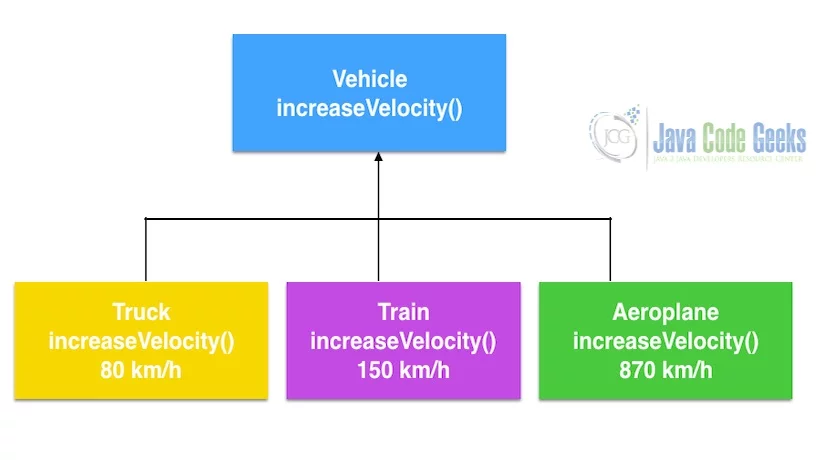

# Getting Started with Java 👨🏻‍💻

## Introduction to Java
Java is a computer programming language that is concurrent, class-based and object-oriented.

## Types of Java Platforms
Java platforms are categorized into different editions, each serving different types of development needs:

- **`Java Standard Edition (Java SE)`**: This is the core Java programming platform. It provides the essential libraries and APIs for general-purpose development.
- **`Java Enterprise Edition (Java EE)`**: Built on top of Java SE, this platform is used for developing large-scale, multi-tiered, scalable, reliable, and secure network applications.
- **`Java Micro Edition (Java ME)`**: This edition is designed for resource-constrained devices such as embedded systems, mobile devices, and IoT devices.
- **`JavaFX`**: A platform for creating rich internet applications using a lightweight user interface API.

### Java Development Kit (JDK)
The JDK is a software development kit used to develop Java applications. It includes the Java Runtime Environment (JRE), an interpreter/loader (Java), a compiler (javac), an archiver (jar), a documentation generator (Javadoc), and other tools needed for Java development.

## Getting Started with Java Development
To start developing in Java, follow these steps:

1. **Install the JDK**: Download and install the latest JDK from the [official Oracle website](https://www.oracle.com/java/technologies/javase-jdk11-downloads.html) or use [OpenJDK](https://openjdk.java.net/).
2. **Set Up Environment Variables**: Configure the `JAVA_HOME` and `PATH` environment variables to point to your JDK installation directory.
3. **Choose an Integrated Development Environment (IDE)**: Popular IDEs for Java development include [IntelliJ IDEA](https://www.jetbrains.com/idea/), [Eclipse](https://www.eclipse.org/), and [NetBeans](https://netbeans.apache.org/).
4. **Write Your First Java Program**: Create a simple "Hello, World!" program to verify your setup.

### What is Java?
Java is a computer programming language that is concurrent, class-based, and object-oriented. The advantages of object-oriented software development are shown below:

- Modular development of code, which leads to easy maintenance and modification.
- Reusability of code.
- Improved reliability and flexibility of code.
- Increased understanding of code.

### Features of Java
Some of the features which play an important role in the popularity of Java are as follows:

- Object-Oriented
- Platform independent
- High Performance
- Multithreaded
- Portable
- Secure

Sample code in Java:

```java
public class FirstProgram{
    public static void main(String[] args) {  
        System.out.println("Sita Ram 🙏");  
    }  
}
```

## Core Java Concepts
Core Java refers to the standard edition of Java (Java SE) and consists of the basic features of the Java programming language.

## Table Of Contents
- [A. How java Code Executes](#how-java-code-executes)
- [B. Object Oriented Programming (OOP)](#b-general-questions-about-java)
- [C. Java Threads](#c-java-threads)
- [D. Java Collections](#d-java-collections)
- [E. Garbage Collectors](#e-garbage-collectors)
- [F. Exception Handling](#f-exception-handling)
- [G. Java Applets](#g-java-applets)
- [H. Swing](#h-swing)
- [I. JDBC](#i-jdbc)
- [J. Remote Method Invocation (RMI)](#j-remote-method-invocation-rmi)
- [K. Servlets](#k-servlets)
- [L. JSP](#l-jsp)


## <a name="how-java-code-executes">How java Code Executes</a>


### Arrays in Java


### 2D Arrays in Java


### ArrayList in Java


### Functoin calls


### Time Complexity


## <a name="b-object-oriented-programming-oop">B. Object Oriented Programming (OOP)</a>

### What are the concepts of OOP?
Object-Oriented Programming (OOP) includes:
>- Abstraction
>- Encapsulation
>- Polymorphism
>- Inheritance
>- Predefined types must be objects
>- User-defined types must be objects
>- Operations must be performed by sending messages to objects

### Is Java 100% Object-oriented?
>Not 100%. Java does not satisfy all the OOP conditions because it uses eight primitive data types (Boolean, byte, char, int, float, double, long, short) which are not objects.

### Classes And Objects

A class is a `template` for an object, and an object is an `instance` of a class.
A class creates a new data type that can be used to create objects.

When you declare an object of a class, you are creating an instance of that class.

- a class is a **logical construct**
- An object has **physical reality**. (That is, an object occupies space in memory.)

Objects are characterized by three essential properties: state, identity, and behavior.
- The `state` of an object is a `value` from its data type. 
- The `identity` of an object `distinguishes` one object from another. It is useful to think of an object’s identity as the `place` where its value is stored in memory.
- The `behavior` of an object is the `effect` of data-type operations.

`Instance variable` are variables inside an Object.(s1.roll)

### How to access instance variable?
Using dot `.` operator - links the name of the object with the name of an instance variable named as separator.

### How to create an Object
Using `new` keyword.
The `new` keyword dynamically allocates ( that is, allocates at run time ) memory for an object & returns a reference to it.
```java
Student s1; // declaration
s1 = new Student(); // Allocation
s1.roll;
```

>NOTE:
>Student student = new Student();
>lhs(reference i.e. student) is looked by compiler & rhs (object i.e. new Student()) is looked by jvm

### Constructors and keywords

`this` - is always a reference to the object on which the method was invoked.

`final` - A field can be declared as final. Doing so prevents its contents from being modified, making it, essentially, a constant.

// syntax -> 
final int FILE_OPEN = 2;

`Constructor` is a `special function` that runs when we create an object and allocate some variables.


### Constructor Overloading
- Student() -> defines what happens when object is created. Default data will come.
- Student( args ) -> then the data sent will come.

- `Default Constructor`
```java
Student s1 = new Student(); // new Student( ) is calling the Student( ) constructor.

Student( ) {
    this.rno = 1;
    this.name = "Aditya";
    this.marks = 85;
}
```
- `Parameterised Constructor`
```java
s1 = new Student(1, "Aditya", 85); // new Student(1, "Aditya", 85) is calling the Student( int rno, String name, float marks ) constructor.

Student( int rno, String name, float marks ) {
    this.rno = rno;
    this.name = name;
    this.marks = mark;
}
```

```java
// To call constructor from another constructor
Student( ) {
    this(1, "Aditya", 85);
}
```

Any class will have a default constructor, does not matter if we declare it in the class or not. *If we inherit a class, then the derived class must call its super class constructor*. It is done by default in derived class.

### Wrapper classes 
Wrapper classes in Java are used to convert primitive data types into objects. Java provides wrapper classes for each of the primitive data types. For example, int has the corresponding wrapper class `Integer`, char has `Character`, and so on.

```java
Integer a = 10;
Integer b = 20;
swap(a, b);
System.out.println(a + " " + b); // 10 20
// will not swap as Integers are final
```

### Packages
Packages are containers for classes. They are used to keep the class name space compartmentalized.

*The package is both a naming and a visibility control mechanism*

> The following statement creates a package called MyPackage: package MyPackage;

When a package is imported, only those items within the package declared as public will be available to non-subclasses
in the importing code.

### Static
When a member is declared `static`, it can be accessed before any objects of its class are created, and without reference to any object. 

`main( )` is declared as static because it must be called before any objects exist.

Static method in Java is a method which `belongs to` the `class` and `not` to the `object`.


```java
public class Human {

    String message = "Hello World";

    public static void display(Human human){
        System.out.println(human.message);
    }

    public static void main(String[] args) {
        Human a = new Human();
        a.message = "Aditya's message";
        Human.display(a);
    }
}
```

- **Static Method**: 
  - Can only access static data.
  - Cannot access non-static data (instance variables).
  - Can call only other static methods.
  - Cannot refer to "this" or "super" keywords.
  - Can be accessed directly by the class name without any object.

- **Non-Static Member**:
  - Belongs to an instance of the class.
  - Cannot be accessed in a static context without an explicit object reference.

If you need to do computation in order to initialize your static variables,
you can declare a static block that gets executed exactly once, when the class is first loaded.

```java
// Demonstrate static variables, methods, and blocks.
class UseStatic {
    static int a = 3;
    static int b;
    static void math(int x) {
        System.out.println("x = " + x);
        System.out.println("a = " + a);
        System.out.println("b = " + b);
    }
    static {
        System.out.println("Static block initialized.");
        b = a * 4;
    }
    public static void main(String args[]) {
        math(42);
    }
}
```

As soon as the UseStatic class is loaded, all of the static statements are run. First, a is set to 3,
then the static block executes, which prints a message and then initializes b to a*4 or 12. Then main( ) is called, which calls math( ), passing 42 to x. The three println( ) statements refer to the two static variables a and b,
as well as to the local variable x.

Here is the output of the program:
Static block initialized. 
x = 42
a = 3
b = 12

### 3. What is Abstraction?
>Abstraction is the process of separating ideas from specific instances and thus, developing classes in terms of their own functionality, instead of their implementation details. Java supports the creation and existence of abstract classes that expose interfaces, without including the actual implementation of all methods. The abstraction technique aims to separate the implementation details of a class from its behavior.

`Abstract Class Person`

```java
public abstract class Person {  
    public abstract String getName(); 
}
```

Employee class extends the Abstract class Person. The method getName returns the name attribute of the employee.

`Employee Class`

```java
public class Employee extends Person {  
    private String name;
     
    public Employee(String name) {
        this.name = name;
    }
    public String getName() {
        return this.name;
    }
    public static void main (String[] args) {  
        Employee employee = new Employee("John Wilson");
        System.out.println("Employee's Name "+ employee.getName()); 
         
        Person person = new Employee("Thomas Smith");
        System.out.println("Employee-Person's Name "+ person.getName());
    }  
}
```

### 6. What is Encapsulation?
>
> Encapsulation provides objects with the ability to hide their internal characteristics and behavior. Each object provides a number of methods, which can be accessed by other objects and change its internal data. In Java, there are three access modifiers: public, private, and protected. Each modifier imposes different access rights to other classes, either in the same or in external packages.

> Some advantages of using encapsulation are:
> - The internal state of every object is protected by hiding its attributes.
> - It increases usability and maintenance of code, because the behavior of an object can be independently changed or extended.
> - It improves modularity by preventing objects to interact with each other in an undesired way.

`Student Class`
```java
public class Student {  
    private int id;  
    private String name;  
    
    public void setId(int id) {
        this.id = id;
    }
    
    public void setName(String name) {
        this.name = name;
    }
    
    public int getId() {
        return this.id;
    }
    
    public String getName() {
        return this.name;
    }
    
    public static void main(String args[]) {  
        Student student = new Student();  
        student.setId(1034);
        student.setName("David Smith");
        
        System.out.println("Student id "+ student.getId());
        System.out.println("Student name "+ student.getName());
    }  
}  

```

### 7. What are the differences between Abstraction and Encapsulation?
> Abstraction and encapsulation are complementary concepts. On the one hand, abstraction focuses on the behavior of an object. On the other hand, encapsulation focuses on the implementation of an object’s behavior. Encapsulation is usually achieved by hiding information about the internal state of an object and thus, can be seen as a strategy used in order to provide abstraction.

### 8. What is Polymorphism?
>`Polymorphism` is the ability of programming languages to present the same interface for differing underlying data types. A polymorphic type is a type whose operations can also be applied to values of some other type.

You can see the example below where Vehicle interface has the method increaseVelocity. Truck, Train and Aeroplane implement the Vehicle Interface and the method increases the velocity to the appropriate velocity related to the vehicle type.


### 9. What are the types of Polymorphism?
>There are two types of Polymorphism in Java:
> - **Compile-time** polymorphism (`Static binding`) – Method overloading
> - **Runtime** polymorphism (`Dynamic binding`) – Method overriding
We can perform polymorphism by Method Overloading and Method Overriding.

### Compile-time vs. Runtime Polymorphism

| Feature                                      | Compile Time                                   | Runtime                                   |
|----------------------------------------------|-----------------------------------------------|-------------------------------------------|
| Methods                                      | Methods of a class have the same name. Each method has a different number of parameters. It can have parameters with different types and order. | The subclass has a method with the name as of a superclass method. It has the number of parameters, type of parameters, and the return type as of a superclass method. |
| Method Behavior                              | Method Overloading is to add to the method’s behavior. It can be extending the method’s behavior. | Method Overriding is to modify the method’s behavior. |
| Method Signatures                            | Overloaded methods will not have the same signature. | Overridden methods will have exactly the same signature. |
| Inheritance Requirement                      | Inheritance is not needed in this case. | Inheritance is required. |

Sample code for overloading method subtract of Calculator Class is shown below:

`Calculator Class`
```java
public class Calculator {
 
    public int subtract(int a, int b) {
        return a - b;
    }
    
    public double subtract(double a, double b) {
        return a - b;
    }
 
    public static void main(String[] args) {
        Calculator calculator = new Calculator();
        System.out.println("Difference of 150 and 12 is " + calculator.subtract(150, 12));
        System.out.println("Difference of 15.5 and 15.4 is " + calculator.subtract(15.50, 15.40));
    }
}
```

Method overriding is shown below in Shape class. Shape has a method getArea.

`Shape Class`
```java
public class Shape {
    public void getArea() {
        System.out.println("Shape Area");
    }  
}
```

Rectangle class overrides getArea method and the implementation of the method is specific to Rectangle. Override annotation is used to indicate to the compiler that the method is overridden. Readability of the code is improved using the annotation.

`Rectangle Class`
```java
public class Rectangle extends Shape {
   
    @Override
    public void getArea() {
        System.out.println("Rectangle Area");
    }
   
    public static void main(String[] args) {
        Shape shape = new Shape();
        shape.getArea();
     
        Rectangle rectangle = new Rectangle();  
        rectangle.getArea();  
    }
}
```

### 10. What is Inheritance?
> Inheritance provides an object with the ability to acquire the fields and methods of another class, called base class. Inheritance provides reusability of code and can be used to add additional features to an existing class, without modifying it.

Sample class Mammal is shown below which has a constructor.

`Mammal Class`
```java
public class Mammal {
    public Mammal() {
        System.out.println("Mammal created");
    }
}
```

Man class extends Mammal which has a default constructor. The sample code is shown below.

`Man Class`
```java
public class Man extends Mammal {
    public Man() {
        System.out.println("Man is created");
    }
}
```

Inheritance is tested by creating an instance of Man using default constructor. The sample code is shown to demonstrate the inheritance.

`TestInheritance`
```java
public class TestInheritance {
    public static void main(String[] args) {
        Man man = new Man();
    }
}
```

### 11. What is composition?
> Composition is exactly like Aggregation except that the lifetime of the ‘part’ is controlled by the ‘whole’. This control may be direct or transitive. That is, the ‘whole’ may take direct responsibility for creating or destroying the ‘part’, or it may accept an already created part, and later pass it on to some other whole that assumes responsibility for it.

Sample class Car is shown below to demonstrate Composition of tires, doors, windows and steering.

`Car Class`
```java
public class Car {
    private Tire[] tires;
    private Door[] doors;
    private Steering steering;
    private Window[] windows;
}

class Tire {
    // Tire properties and methods can be added here
}

class Door {
    // Door properties and methods can be added here
}

class Steering {
    // Steering properties and methods can be added here
}

class Window {
    // Window properties and methods can be added here
}
```

### 12. What is an association?
> Association represents the ability of one instance to send a message to another instance. This is typically implemented with a pointer or reference instance variable, although it might also be implemented as a method argument or the creation of a local variable.

### 13. What is aggregation?
> Aggregation is the typical whole/part relationship. This is exactly the same as an association with the exception that instances cannot have cyclic aggregation relationships.

Sample class Person is shown below to demonstrate Aggregation relationship with Address.

`Person Class`
```java
public class Person {
    private Address address;
}

class Address {
    private String city;
    private String state;
    private String country;
    private String line1;
    private String line2;
    
    // Address properties and methods can be added here
}

```