# Data Structures and Algorithms

## Table of Contents
1. [Introduction](#introduction)
   - [1.1 Variables](#variables)
   - [1.2 Data Types](#data-types)
   - [1.3 Data Structures](#data-structures)
   - [1.4 Algorithms](#algorithms)
   - [1.5 Types of Analysis of an Algorithm](#types-of-analysis)
   - [1.6 Asymptotic Notation](#asymptotic-notation)
   - [1.7 Big-O Notation](#big-o-notation)
   - [1.8 Omega (Ω) Notation](#omega-notation)
   - [1.9 Theta (&#952;) Notation](#theta-notation)
2. [Recursion and Backtracking](#recursion-backtracking)
   - [2.1 What is Recursion?](#what-is-recursion)
   - [2.2 Recursion versus Iteration](#recursion-vs-iteration)
   - [2.3 What is Backtracking?](#what-is-backtracking)
3. [Linked Lists](#linked-lists)
   - [3.1 What is a Linked List?](#what-is-linked-list)
   - [3.2 Linked Lists ADT](#linked-lists-adt)
   - [3.3 Singly Linked Lists](#singly-linked-lists)
   - [3.4 Doubly Linked Lists](#doubly-linked-lists)
   - [3.5 Circular Linked Lists](#circular-linked-lists)
   - [3.6 Performance and Limitations](#performance-limitations-linked-lists)
4. [Stacks](#stacks)
   - [4.1 What is a Stack?](#what-is-a-stack)
   - [4.2 Stack ADT](#stack-adt)
   - [4.3 Performance & Limitations](#performance-limitations)
5. [Queues](#queues)
   - [5.1 What is a Queue?](#what-is-a-queue)
   - [5.2 Queue ADT](#queue-adt)
   - [5.3 Performance and Limitations](#performance-limitations-queues)
6. [Trees](#trees)
    - [What is a Tree?](#what-is-a-tree)
    - [Binary Trees](#binary-trees)
    - [Types of Binary Trees](#types-of-binary-trees)
    - [Properties of Binary Trees](#properties-of-binary-trees)
    - [Structure of Binary Trees](#structure-of-binary-trees)

## <a name="introduction"></a>INTRODUCTION

### <a name="variables"></a>1.1 Variables

Variables are a way of holding data in programming.

### <a name="data-types"></a>1.2 Data Types

A *data type* in a programming language is a set of data with predefined values. Examples include integer, floating point, unit number, character, string, etc.

Data types reduce coding effort. At the top level, there are two types of data types:  
- **System-defined data types (Primitive data types):** Defined by the system, examples include `int`, `float`, `char`, `double`, `bool`.
- **User-defined data types:** Created by programmers when system-defined types are insufficient. Examples include:
  - **Structures (C/C++):** Combine multiple data types into a single entity.
  - **Classes (Java):** Objects that encapsulate data and behavior.

  ```java
  public class Person {
    private String name;
    private String place;
  }
  ```

### <a name="data-structures"></a>1.3 Data Structures

A *data structure* is a particular way of storing and organizing data in a computer so that it can be used efficiently.

Data structures are classified into two types:

1) **Linear data structure:** Elements are accessed in a sequential order, though not necessarily stored sequentially (e.g., Linked Lists). Examples: Linked Lists, Stacks, Queues.
2) **Non-Linear data structure:** Elements are stored/accessed in a non-linear order. Examples: Trees and Graphs.

### <a name="algorithms"></a>1.4 Algorithms

An algorithm is a step-by-step, unambiguous set of instructions to solve a given problem.

Two main criteria for judging algorithms are:
- **Correctness:** Does the algorithm give a solution to the problem in a finite number of steps?
- **Efficiency:** How much resources (memory and time) does it take to execute?

<p align="center">
  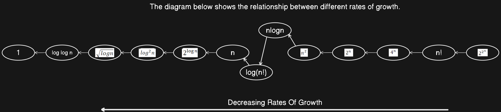
</p>

### <a name="types-of-analysis"></a>1.5 Types of Analysis of an Algorithm

Analyzing an algorithm requires a formal syntax, forming the basis for asymptotic analysis/notation. There are three types of analysis:

- **Worst Case:** The input for which the algorithm takes the longest time.
- **Best Case:** The input for which the algorithm takes the least time.
- **Average Case:** Provides a prediction about the running time based on a random distribution of inputs.

*<p align="center">Lower Bound <= Average Time <= Upper Bound</p>*

### <a name="asymptotic-notation"></a>1.6 Asymptotic Notation

To represent upper and lower bounds, a function `f(n)` is used.

### <a name="big-o-notation"></a>1.7 Big-O Notation

This notation gives the tight upper bound of the given function, generally represented as `f(n) = O(g(n))`. At larger values of `n`, the upper bound of `f(n)` is `g(n)`.

For example, if `f(n) = n^4 + 100n^2 + 10n + 50`, then `g(n)` would be `n^4`.

<p align="center">
  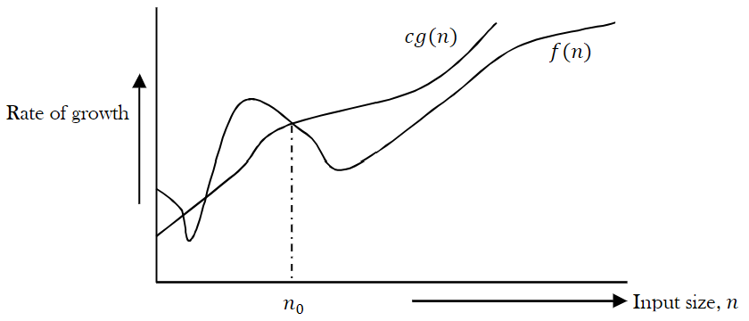
</p>

- **Big-O Visualization:**  
  `O(g(n))` is the set of functions with smaller or the same order of growth as `g(n)`. For example: `O(n^2)` includes `O(1)`, `O(n)`, `O(nlogn)`, etc.

### <a name="omega-notation"></a>1.8 Omega (Ω) Notation [Lower Bounding Function]

Similar to Big-O, this notation gives the tighter lower bound of the given algorithm, represented as `f(n) = Ω(g(n))`. At larger values of `n`, the tighter lower bound of `f(n)` is `g(n)`.

For example, if `f(n) = 100n^2 + 10n + 50`, then `g(n)` is `Ω(n^2)`.

<p align="center">
  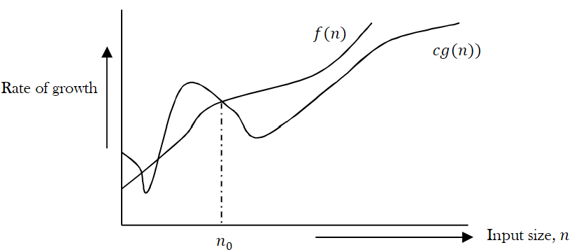
</p>

### <a name="theta-notation"></a>1.9 Theta (&#952;) Notation

Theta notation decides whether the upper and lower bounds of a given function (algorithm) are the same. It represents the average running time of an algorithm, which is always between the lower bound and the upper bound.

<p align="center">
  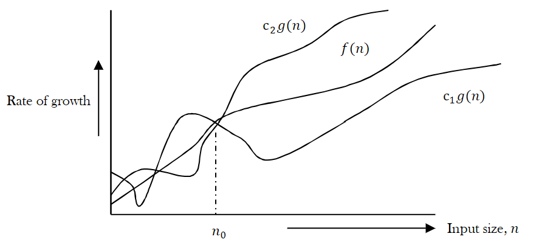
</p>

> For analysis (best case, worst case, and average), the upper bound (O), lower bound (Ω), and average running time (&#952;) are given.

## <a name="recursion-backtracking"></a>RECURSION AND BACKTRACKING

### <a name="what-is-recursion"></a>2.1 What is Recursion?

A function that calls itself is called *recursive*. A recursive method solves a problem by calling a copy of itself to work on a smaller problem. This is known as the *recursion step*.

Recursive code is generally shorter and easier to write than iterative code.

```java
if(test for the base case) 
  return some base case value 
else if(test for another base case) 
  return some other base case value 
  
// the recursive case 
else return (some work and then a recursive call) 
```

<p align="center">
  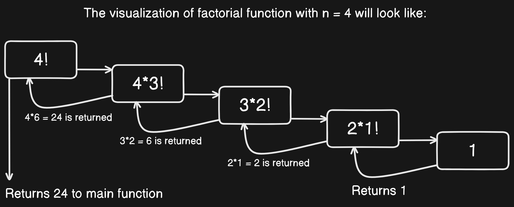
</p>

### <a name="recursion-vs-iteration"></a>2.2 Recursion versus Iteration

**Recursion**  
- Terminates when a base case is reached. 
- Each recursive call requires extra space on the stack frame (memory). 
- Infinite recursion may cause a stack overflow due to memory exhaustion. 
- Some problems are easier to solve using recursion.

**Iteration**  
- Terminates when a condition is proven to be false. 
- Each iteration does not require any extra space. 
- An infinite loop could run forever since no extra memory is being created. 
- Iterative solutions may not always be as obvious as recursive solutions.

### <a name="what-is-backtracking"></a>2.3 What is Backtracking?

Backtracking is an improvement on the brute force approach. It systematically searches for a solution to a problem among all available options.

In backtracking, we start with one possible option out of many available options and try to solve the problem. If we can solve the problem with the selected move, we print the solution; otherwise, we backtrack and select another option. If none of the options work, we conclude that there is no solution to the problem.

## <a name="linked-lists"></a>LINKED LISTS

### <a name="what-is-linked-list"></a>3.1 What is a Linked List?

A linked list is a data structure used for storing collections of data. A linked list has the following properties:

- A linked list is a linear dynamic data structure.
- Successive elements are connected by pointers.
- The last element points to NULL.
- Can grow or shrink in size during execution of a program.
- Can be made just as long as required (until system memory is exhausted).
- Does not waste memory space (but takes some extra memory for pointers). It allocates memory as the list grows.

<p align="center">
  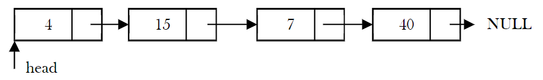
</p>

### <a name="linked-lists-adt"></a>3.2 Linked Lists ADT

The following operations make linked lists an ADT:

**Main Linked Lists Operations**  
- `Insert:` Inserts an element into the list.
- `Delete:` Removes and returns the specified position element from the list.

**Auxiliary Linked Lists Operations**  
- `Delete List:` Removes all elements of the list (disposes the list).
- `Count:` Returns the number of elements in the list.
- `Find` n<sup>th</sup> node from the end of the list.

**Advantages**
- Linked lists can be *expanded* in constant time.

**Disadvantages**
- The main disadvantage of linked lists is *access time* to individual elements. Linked lists take `O(n)` for access to an element in the list in the worst case.
- Linked lists waste memory in terms of extra reference points.

### <a name="singly-linked-lists"></a>3.3 Singly Linked Lists

The linked list consists of a series of structures called nodes. Each node has two parts:
- A *data* field that stores the data.
- A *next* field that is a pointer used to link one node to the next node.

The link of the last node in the list is NULL, which indicates the end of the list.

<p align="center">
  
</p>

### <a name="doubly-linked-lists"></a>3.4 Doubly Linked Lists

The *advantage* of a doubly linked list (also called a *two-way linked list*) is that given a node in the list, we can navigate in both directions.

**Primary Disadvantages**  
- Each node requires an extra pointer, requiring more space.
- The insertion or deletion of a node takes a bit longer (more pointer operations).

<p align="center">
  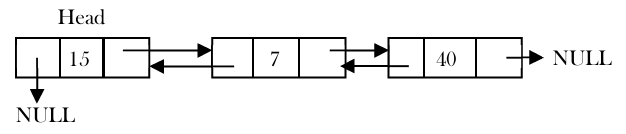
</p>

### <a name="circular-linked-lists"></a>3.5 Circular Linked Lists

In singly linked lists and doubly linked lists, the end of the list is indicated with a NULL value. In contrast, circular linked lists do not have an end; instead, the last node points to the head of the list.

<p align="center">
  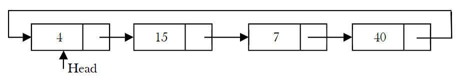
</p>

### <a name="performance-limitations-linked-lists"></a>3.6 Performance and Limitations

**Performance**  
- Space Complexity (for *n* nodes): `O(n)`
- Time Complexity of `Insert()` (at a known position): `O(1)`
- Time Complexity of `Delete()` (at a known position): `O(1)`
- Time Complexity of `Search()` or `Find()`: `O(n)`

**Limitations**  
- Slower access time for individual elements compared to arrays: `O(n)`
- Additional memory is required for pointers in each node.


## <a name="stacks"></a>STACKS

### <a name="what-is-a-stack"></a>4.1 What is a Stack?

A *stack* is an ordered list in which insertion and deletion are done at one end, called the *top*. The last element inserted is the first one to be deleted. Hence, it is called the Last In, First Out (LIFO) or First In, Last Out (FILO) list.

When an element is inserted in a stack, the concept is called *push*, and when an element is removed from the stack, the concept is called *pop*. Trying to pop out an empty stack is called *underflow* and trying  to push an element in a full stack is called *overflow*.

<p align="center">
  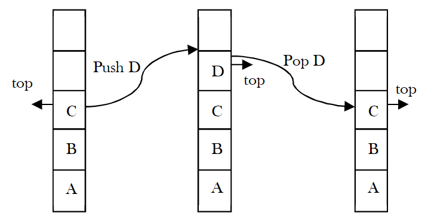
</p>

### <a name="stack-adt"></a>4.2 Stack ADT

The following operations make a stack an ADT. For simplicity, assume the data is of integer type.

**Main Stack Operations**  
- `void push(int data)`: Inserts `data` onto the stack.
- `int pop()`: Removes and returns the last inserted element from the stack.

**Auxiliary Stack Operations**  
- `int top()`: Returns the last inserted element without removing it.
- `int size()`: Returns the number of elements stored in the stack.
- `boolean isEmpty()`: Indicates whether any elements are stored in the stack or not.
- `boolean isFull()`: Indicates whether the stack is full or not.

### <a name="performance-limitations"></a>4.3 Performance & Limitations

**Performance**  
- Space complexity (for *n* push operations): `O(n)`
- Time complexity of `push()` and `pop()`: `O(1)`

**Limitations**  
- The maximum size of the stack must be defined beforehand and cannot be changed. Trying to push a new element into a full stack causes an implementation-specific exception (commonly known as *overflow*).

## <a name="queues"></a>QUEUES

### <a name="what-is-a-queue"></a>5.1 What is a Queue?

A *queue* is an ordered list in which insertions are done at one end (*rear*) and deletions are done at the other end (*front*). The first element to be inserted is the first one to be deleted. Hence, it is called First In, First Out (FIFO) or Last In, Last Out (LILO) list.

When an element is inserted into a queue, the concept is called *EnQueue*. When an element is removed from the queue, the concept is called *DeQueue*. *DeQueueing* an empty queue is called *underflow*, and *EnQueueing* an element into a full queue is called *overflow*.

<p align="center">
  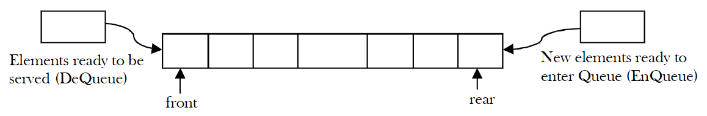
</p>

### <a name="queue-adt"></a>5.2 Queue ADT

The following operations make a queue an ADT. Insertions and deletions in the queue must follow the FIFO scheme. For simplicity, we assume the elements are integers.

**Main Queue Operations**  
- `void enQueue(int data)`: Inserts an element at the end of the queue (at rear).
- `int deQueue()`: Removes and returns the element from the front of the queue.

**Auxiliary Queue Operations**  
- `int front()`: Returns the element at the front without removing it.
- `int rear()`: Returns the element at the rear without removing it.
- `int size()`: Returns the number of elements stored in the queue.
- `boolean isEmpty()`: Indicates whether no elements are stored in the queue or not.

### <a name="performance-limitations-queues"></a>5.3 Performance and Limitations

**Performance**  
- Space Complexity (for *n* enQueue operations): `O(n)`
- Time Complexity of `enQueue()`: `O(1)`
- Time Complexity of `deQueue()`: `O(1)`

**Limitations**  
- The maximum size of the queue must be defined beforehand and cannot be changed. Trying to *Enqueue* a new element into a full queue causes an implementation-specific exception (commonly known as *overflow*).


## <a name="trees"></a>TREES


### <a name="what-is-a-tree"></a>6.1 What is a Tree?

A *tree* is a data structure similar to a linked list, but instead of each node pointing to the next node in a linear fashion, each node points to a number of nodes. A tree is an example of a non-linear data structure. A tree structure is a way of representing the hierarchical nature of a structure in a graphical form.

<p align="center">
  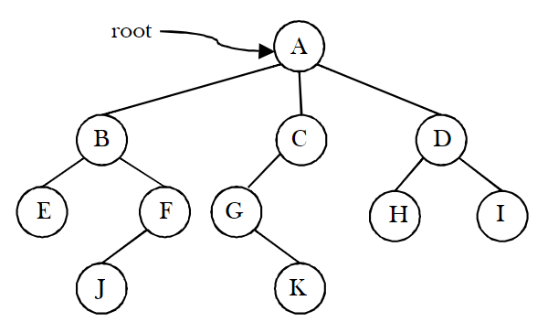
</p>

- The *root* of a tree is the node with no parents. There can be at most one `root` node in a tree (node *A* in the above example).
- An *edge* refers to the link from parent to child (all links in the figure).
- A node with no children is called a `leaf node` (*E, J, K, H,* and *I*).
- Children of the same parent are called `siblings` (*B, C,* and *D* are siblings of *A,* and *E, F* are the siblings of *B*).
- A node `p` is an `ancestor` of node `q` if there exists a path from the `root` to `q` and `p` appears on the path. The node `q` is called a `descendant` of `p`. For example, *A, C,* and *G* are the ancestors of *K*.
- The set of all nodes at a given depth is called the `level` of the tree (*B, C,* and *D* are on the same level). The `root` node is at level zero.

<p align="center">
  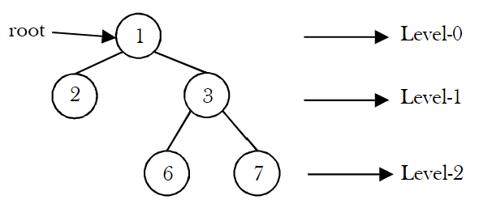
</p>

- The `depth` of a node is the length of the path from the `root` to the node (the depth of *G* is 2, *A – C — G*).
- The `height` of a `node` is the length of the path from that node to the deepest node. The `height` of a `tree` is the length of the path from the `root` to the deepest node in the tree. A (rooted) tree with only one node (the root) has a height of zero. In the previous example, the height of *B* is 2 (*B — F — J*).
- The `height of the tree` is the maximum height among all the nodes in the tree, and `depth of the tree` is the maximum depth among all the nodes in the tree. For a given tree, depth and height return the same value. But for individual nodes, we may get different results.
- The `size` of a node is the number of descendants it has, including itself (the size of the subtree *C* is 3).
- If every node in a tree has only one child (except leaf nodes), then we call such trees `skew trees`. If every node has only a left child, then we call them *left-skewed trees*. Similarly, if every node has only a right child, then we call them *right-skewed trees*.

<p align="center">
  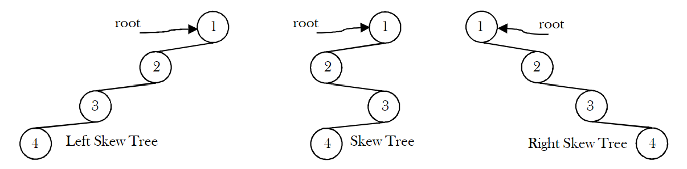
</p>

### <a name="binary-trees"></a>6.2 Binary Trees

A tree is called a `binary tree` if each node has zero children, one child, or two children. An empty tree is also a valid `binary tree`. We can visualize a `binary tree` as consisting of a root and two disjoint binary trees, called the left and right subtrees of the root.

<p align="center">
  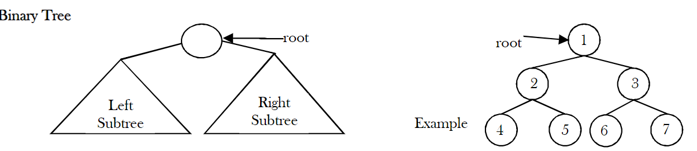
</p>

### <a name="types-of-binary-trees"></a>6.3 Types of Binary Trees

**Strict Binary Tree:** A binary tree is called a `strict binary tree` if each node has exactly two children or no children.

<p align="center">
  
</p>

**Full Binary Tree:** A binary tree is called a `full binary tree` if each node has exactly two children, and all leaf nodes are at the same level.

<p align="center">
  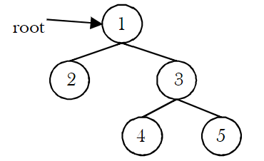
</p>

**Complete Binary Tree:** Before defining the `complete binary tree`, let us assume that the height of the binary tree is ℎ.

A binary tree is called a `complete binary tree` if all leaf nodes are at height ℎ or ℎ−1 and also without any missing number in the sequence.

<p align="center">
  
</p>

### <a name="properties-of-binary-trees"></a>6.4 Properties of Binary Trees

For the following properties, let us assume that the height of the tree is ℎ. Also, assume that the `root` node is at height zero.

<p align="center">
  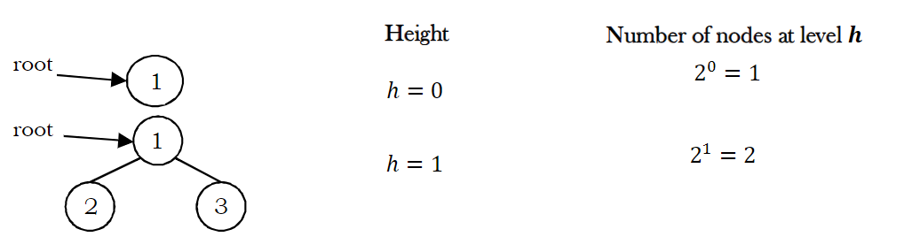
</p>
<p align="center">
  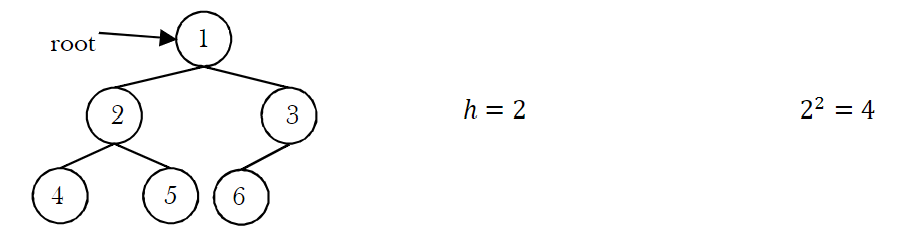
</p>

From the diagrams, we can infer the following properties:
- The number of nodes `n` in a `full binary tree` is 2<sup>*h+1*</sup> - 1. Since there are *h* levels, we need to add all nodes at each level [2<sup>*0*</sup> + 2<sup>*1*</sup> + 2<sup>*2*</sup> + ... + 2<sup>*h*</sup> = 2<sup>*h+1*</sup> - 1].
- The number of nodes `n` in a `complete binary tree` is between 2<sup>*h*</sup> (minimum) and 2<sup>*h+1*</sup> − 1 (maximum).
- The number of `leaf nodes` in a `full binary tree` is 2<sup>*n*</sup>.
- The number of `None` links (wasted pointers) in a `complete binary tree` of `n` nodes is `n` + 1.

### <a name="structure-of-binary-trees"></a>6.5 Structure of Binary Trees

One way to represent a node (which contains data) is to have two links that point to the left and right children along with data fields, as shown below:

<p align="center">
  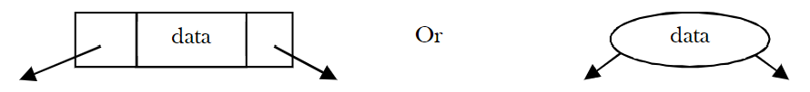
</p>